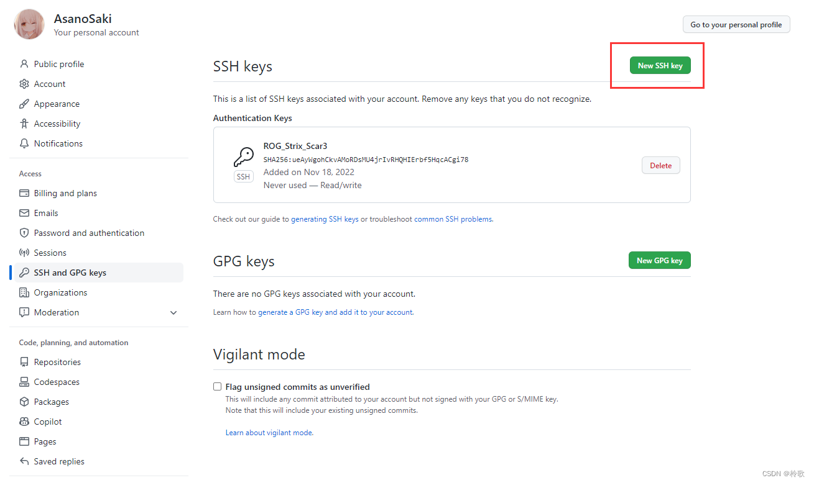
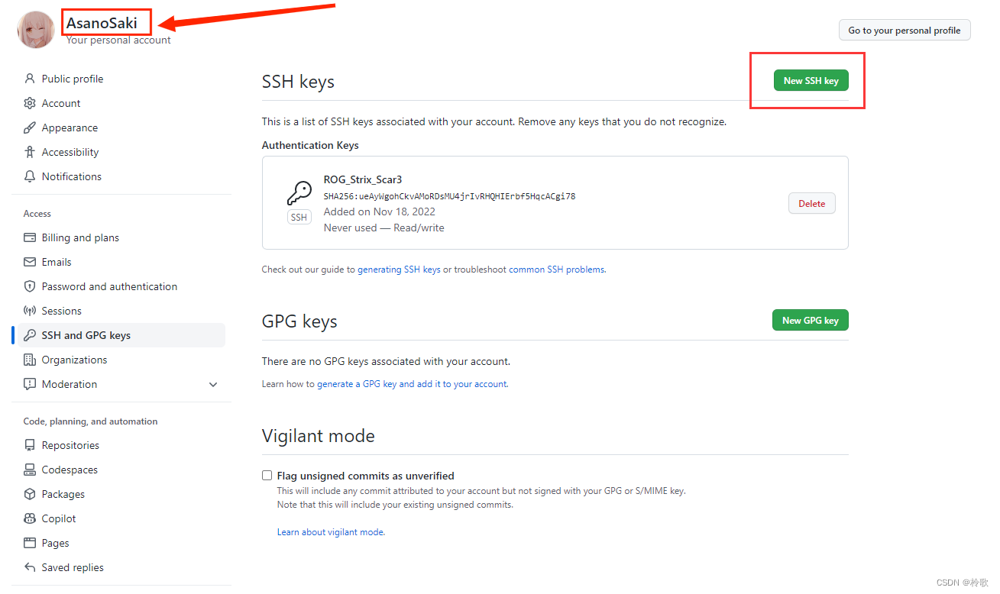
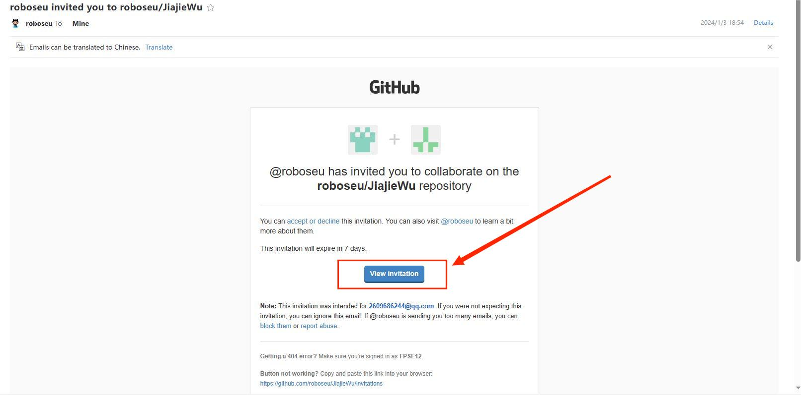
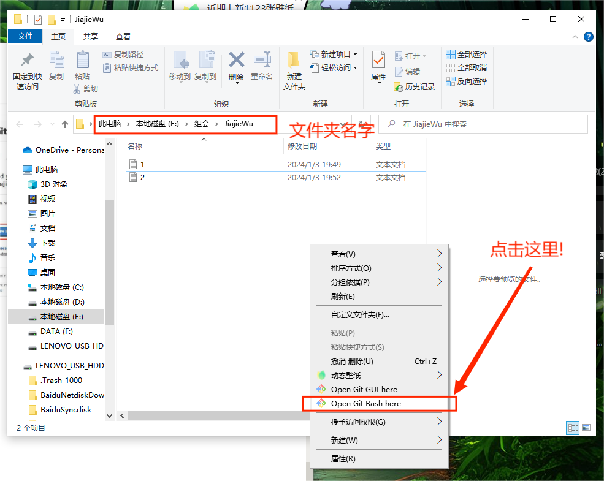

# Github组会上传教程

## 第一步： 下载注册Github账号

[GitHub账号注册教程_github注册用户名-CSDN博客](https://blog.csdn.net/qq_34379645/article/details/113857402?spm=1001.2101.3001.6650.10&utm_medium=distribute.pc_relevant.none-task-blog-2%7Edefault%7EBlogCommendFromBaidu%7ERate-10-113857402-blog-128808210.235%5Ev40%5Epc_relevant_anti_vip&depth_1-utm_source=distribute.pc_relevant.none-task-blog-2%7Edefault%7EBlogCommendFromBaidu%7ERate-10-113857402-blog-128808210.235%5Ev40%5Epc_relevant_anti_vip&utm_relevant_index=18)

## 第二步： 配置本地Git环境（win/ubuntu)

### 2-1：win系统下安装Git

1)：配置Git环境需要自己下载Git安装包（可能要科学上网），然后一路默认安装就可以，安装下载链接：

[Git - Downloading Package](https://git-scm.com/download/win)

2)：测试安装成功，打开CMD，输入命令：

```jsx
git --version
```

显示git版本号，则安装成功

3）：安装Github客户端（可选，使用客户端方便上传文件，也不用安装Git）

下载链接：

[安装 GitHub Desktop - GitHub 文档](https://docs.github.com/zh/desktop/installing-and-authenticating-to-github-desktop/installing-github-desktop)

### 2-2：ubuntu系统下安装Git

直接输入命令：

```jsx
sudo apt update
sudo apt install git
```

### 2-3: 配置Git

直接用命令行：

```jsx
git config --global user.name "Github用户名"
git config --global user.email "Github邮箱"
eg:------------
git config --global user.name "AsanoSaki"
git config --global user.email "Yujie_Yi@foxmail.com"

```

生成公钥：

```jsx
ssh-keygen -t rsa
```

生成之后一路回车

将 ~/.ssh/id_rsa.pub中的内容复制到 GitHub 的 SSH Keys 中:



这样就链接上啦！

## 第三步：成为组会的开发者

### 1）把第二步创建的Github账号名给**亲爱的万博，之后他会给你发个邀请邮件（Github注册的邮箱）**



### 2）点击邮件里的验证链接并接受就可以



## 第四步：上传组会内容

### 1）创建本地仓库

创建本地文件夹，并且在文件夹内打开Git bash



### 2）上传文件

输入以下命令：

```jsx
### 第一次上传 ###
git init 
git add 需要添加的文件名
git commit -m "first commit"
git branch -M main
git remote add origin https://github.com/roboseu/YanPan.git
git push -u origin main

### 后续上传 ###
git add *
git commit -m "随便写"
git push
```

然后就可以在你的Github上看到上传的内容啦！


## 其他常用Git命令

删除远程仓库文件的命令（本地不删除，如果本地删除的话，去掉  “cached”）

```jsx
git rm -n --cached 需要删除的文件
git rm -r --cached 需要删除的文件

git commit -m "随便写"
git push
```